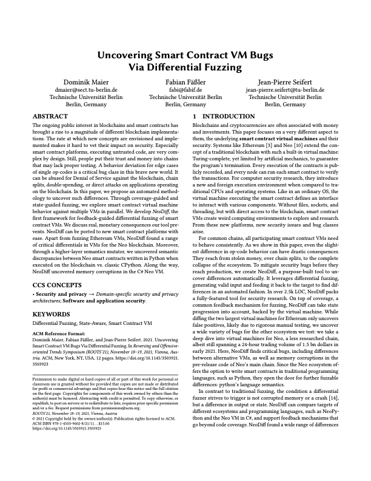

# NeoDiff

This repository contains the source code for NeoDiff, a framework for differential fuzzing of Smart-Contract VMs, introduced by "Uncovering Smart Contract VM Bugs Via Differential Fuzzing".
It will mutate smart contract byte code and look for differences in the VM state, leading to potential chain splits.

## Getting started

To get started, run `setup.sh`.
The script will check out Ethereum VMs in `go` (`go-ethereum`) and `rust` (`openethereum`), and install the needed python virtual env for NeoDiff.
then, source the virtualenv using `. .env/bin/activate` and run `EVMrun.sh 1` or `EVMscale.sh [proc_count]` to start fuzzing.

## Other Targets
Apart from EVM, NeoDiff has been tested on Neo VMs and should be trivial to port to other VMs.
Check out `NeoVMFuzz.py` and `NeoSemanticDiffFuzzer.py` for examples.

